# Database Diagram

Day la logical ERD cho database hien tai. Cac quan he cung schema la foreign
key that. Cac quan he cheo module duoc xem la UUID reference, khong tao foreign
key vat ly de sau nay tach microservice de hon.

```mermaid
erDiagram
    IDENTITY_USERS ||--o{ IDENTITY_USER_ROLES : has
    IDENTITY_ROLES ||--o{ IDENTITY_USER_ROLES : assigned
    IDENTITY_ROLES ||--o{ IDENTITY_ROLE_PERMISSIONS : has
    IDENTITY_PERMISSIONS ||--o{ IDENTITY_ROLE_PERMISSIONS : grants
    IDENTITY_USERS ||--o{ IDENTITY_LOGIN_SESSIONS : owns

    IDENTITY_USERS ||--|| CUSTOMER_CUSTOMERS : user_id_uuid
    CUSTOMER_CUSTOMERS ||--o{ CUSTOMER_CUSTOMER_ROLES : has
    CUSTOMER_CUSTOMERS ||--o| CUSTOMER_HOST_PROFILES : can_be_host
    CUSTOMER_CUSTOMERS ||--o| CUSTOMER_KYC_PROFILES : verifies
    CUSTOMER_KYC_PROFILES ||--o{ CUSTOMER_KYC_DOCUMENTS : contains
    CUSTOMER_CUSTOMERS ||--o{ CUSTOMER_ADDRESSES : owns

    CUSTOMER_CUSTOMERS ||--o{ VEHICLE_VEHICLES : owner_customer_id_uuid
    FLEET_COMPANY_VEHICLES ||--|| VEHICLE_VEHICLES : vehicle_id_uuid
    VEHICLE_VEHICLES ||--o| VEHICLE_LISTINGS : publishes
    VEHICLE_VEHICLES ||--o{ VEHICLE_IMAGES : has
    VEHICLE_VEHICLES ||--o{ VEHICLE_FEATURES : has
    VEHICLE_VEHICLES ||--o{ VEHICLE_AVAILABILITY_BLOCKS : blocks

    FLEET_BRANCHES ||--o{ FLEET_COMPANY_VEHICLES : manages
    FLEET_COMPANY_VEHICLES ||--o{ FLEET_MAINTENANCE_RECORDS : has
    FLEET_COMPANY_VEHICLES ||--o{ FLEET_INSURANCE_POLICIES : has
    FLEET_COMPANY_VEHICLES ||--o{ FLEET_INSPECTION_RECORDS : has

    DRIVER_DRIVERS ||--o{ DRIVER_DOCUMENTS : has
    DRIVER_DRIVERS ||--o{ DRIVER_AVAILABILITY_SLOTS : has
    DRIVER_DRIVERS ||--o{ DRIVER_ASSIGNMENTS : assigned

    VEHICLE_VEHICLES ||--o{ PRICING_PRICE_PLANS : target_id_uuid
    PRICING_PROMOTIONS ||--o{ PRICING_PROMOTION_REDEMPTIONS : redeemed
    PRICING_QUOTES ||--o{ PRICING_QUOTE_ITEMS : contains

    CUSTOMER_CUSTOMERS ||--o{ BOOKING_BOOKINGS : customer_id_uuid
    CUSTOMER_CUSTOMERS ||--o{ BOOKING_BOOKINGS : host_customer_id_uuid
    VEHICLE_VEHICLES ||--o{ BOOKING_BOOKINGS : vehicle_id_uuid
    DRIVER_DRIVERS ||--o{ BOOKING_BOOKINGS : driver_id_uuid
    PRICING_QUOTES ||--o{ BOOKING_BOOKINGS : quote_id_uuid
    BOOKING_BOOKINGS ||--o{ BOOKING_STATUS_HISTORY : changes
    BOOKING_BOOKINGS ||--o{ BOOKING_TRIP_CHECKLISTS : has
    BOOKING_TRIP_CHECKLISTS ||--o{ BOOKING_TRIP_CHECKLIST_ITEMS : contains
    BOOKING_BOOKINGS ||--o| BOOKING_CANCELLATIONS : may_have

    BOOKING_BOOKINGS ||--o{ PAYMENT_PAYMENT_INTENTS : booking_id_uuid
    PAYMENT_PAYMENT_INTENTS ||--o{ PAYMENT_TRANSACTIONS : creates
    PAYMENT_TRANSACTIONS ||--o{ PAYMENT_REFUNDS : can_refund
    BOOKING_BOOKINGS ||--o{ PAYMENT_PAYOUTS : booking_id_uuid

    BOOKING_BOOKINGS ||--o{ REVIEW_REVIEWS : booking_id_uuid
    REVIEW_REVIEWS ||--o{ REVIEW_REPLIES : has
    REVIEW_REVIEWS ||--o{ REVIEW_REPORTS : can_be_reported

    NOTIFICATION_NOTIFICATIONS ||--o{ NOTIFICATION_DELIVERY_LOGS : logs
    NOTIFICATION_TEMPLATES ||--o{ NOTIFICATION_NOTIFICATIONS : template_code
    IDENTITY_USERS ||--o{ NOTIFICATION_DEVICES : user_id_uuid

    IDENTITY_USERS ||--o{ ADMIN_AUDIT_LOGS : actor_user_id_uuid
    IDENTITY_USERS ||--o{ ADMIN_BACKOFFICE_TASKS : assigned_to_uuid

    COMMON_OUTBOX_EVENTS {
        uuid id PK
        string aggregate_type
        uuid aggregate_id
        string event_type
        json payload
        string status
    }

    COMMON_IDEMPOTENCY_KEYS {
        uuid id PK
        string key_value UK
        string owner_type
        uuid owner_id
        string request_hash
    }

    IDENTITY_USERS {
        uuid id PK
        string phone UK
        string email UK
        string external_subject UK
        string status
    }

    IDENTITY_ROLES {
        uuid id PK
        string code UK
        string name
    }

    IDENTITY_PERMISSIONS {
        uuid id PK
        string code UK
    }

    IDENTITY_USER_ROLES {
        uuid user_id FK
        uuid role_id FK
    }

    IDENTITY_ROLE_PERMISSIONS {
        uuid role_id FK
        uuid permission_id FK
    }

    IDENTITY_LOGIN_SESSIONS {
        uuid id PK
        uuid user_id FK
        string refresh_token_hash
        datetime expires_at
    }

    CUSTOMER_CUSTOMERS {
        uuid id PK
        uuid user_id
        string full_name
        string status
    }

    CUSTOMER_CUSTOMER_ROLES {
        uuid customer_id FK
        string role
    }

    CUSTOMER_HOST_PROFILES {
        uuid id PK
        uuid customer_id FK
        string host_code UK
        string status
    }

    CUSTOMER_KYC_PROFILES {
        uuid id PK
        uuid customer_id FK
        string document_type
        string status
    }

    CUSTOMER_KYC_DOCUMENTS {
        uuid id PK
        uuid kyc_profile_id FK
        string document_side
        string file_url
    }

    CUSTOMER_ADDRESSES {
        uuid id PK
        uuid customer_id FK
        string city
        boolean is_default
    }

    VEHICLE_VEHICLES {
        uuid id PK
        uuid owner_customer_id
        uuid fleet_vehicle_id
        string source
        string license_plate UK
        string status
    }

    VEHICLE_LISTINGS {
        uuid id PK
        uuid vehicle_id FK
        string title
        decimal base_daily_rate
        string status
    }

    VEHICLE_IMAGES {
        uuid id PK
        uuid vehicle_id FK
        string file_url
        boolean is_cover
    }

    VEHICLE_FEATURES {
        uuid id PK
        uuid vehicle_id FK
        string code
        string name
    }

    VEHICLE_AVAILABILITY_BLOCKS {
        uuid id PK
        uuid vehicle_id FK
        datetime start_at
        datetime end_at
        string reason
    }

    FLEET_BRANCHES {
        uuid id PK
        string code UK
        string name
        string city
    }

    FLEET_COMPANY_VEHICLES {
        uuid id PK
        uuid vehicle_id
        uuid branch_id FK
        string asset_code UK
        string asset_status
    }

    FLEET_MAINTENANCE_RECORDS {
        uuid id PK
        uuid company_vehicle_id FK
        string maintenance_type
        decimal cost_amount
    }

    FLEET_INSURANCE_POLICIES {
        uuid id PK
        uuid company_vehicle_id FK
        string provider_name
        date valid_to
    }

    FLEET_INSPECTION_RECORDS {
        uuid id PK
        uuid company_vehicle_id FK
        date inspection_date
        string result
    }

    DRIVER_DRIVERS {
        uuid id PK
        uuid user_id
        string driver_code UK
        string phone UK
        string status
    }

    DRIVER_DOCUMENTS {
        uuid id PK
        uuid driver_id FK
        string document_type
        string file_url
    }

    DRIVER_AVAILABILITY_SLOTS {
        uuid id PK
        uuid driver_id FK
        datetime start_at
        datetime end_at
        string status
    }

    DRIVER_ASSIGNMENTS {
        uuid id PK
        uuid driver_id FK
        uuid booking_id
        string status
    }

    PRICING_PRICE_PLANS {
        uuid id PK
        string target_type
        uuid target_id
        decimal base_daily_rate
        string status
    }

    PRICING_PROMOTIONS {
        uuid id PK
        string code UK
        string discount_type
        decimal discount_value
        string status
    }

    PRICING_QUOTES {
        uuid id PK
        uuid customer_id
        uuid vehicle_id
        string service_type
        decimal total_amount
    }

    PRICING_QUOTE_ITEMS {
        uuid id PK
        uuid quote_id FK
        string item_type
        decimal total_amount
    }

    PRICING_PROMOTION_REDEMPTIONS {
        uuid id PK
        uuid promotion_id FK
        uuid customer_id
        uuid booking_id
    }

    BOOKING_BOOKINGS {
        uuid id PK
        string booking_code UK
        uuid customer_id
        uuid vehicle_id
        string service_type
        string vehicle_source
        string status
        decimal total_amount
    }

    BOOKING_STATUS_HISTORY {
        uuid id PK
        uuid booking_id FK
        string from_status
        string to_status
    }

    BOOKING_TRIP_CHECKLISTS {
        uuid id PK
        uuid booking_id FK
        string checklist_type
        integer odometer_km
    }

    BOOKING_TRIP_CHECKLIST_ITEMS {
        uuid id PK
        uuid checklist_id FK
        string item_code
        string condition
    }

    BOOKING_CANCELLATIONS {
        uuid id PK
        uuid booking_id FK
        string cancelled_by_type
        decimal refund_amount
    }

    PAYMENT_PAYMENT_INTENTS {
        uuid id PK
        uuid booking_id
        uuid payer_customer_id
        decimal amount
        string status
    }

    PAYMENT_TRANSACTIONS {
        uuid id PK
        uuid payment_intent_id FK
        string transaction_code UK
        string status
    }

    PAYMENT_REFUNDS {
        uuid id PK
        uuid transaction_id FK
        string refund_code UK
        decimal amount
        string status
    }

    PAYMENT_PAYOUTS {
        uuid id PK
        string recipient_type
        uuid recipient_id
        uuid booking_id
        decimal amount
        string status
    }

    REVIEW_REVIEWS {
        uuid id PK
        uuid booking_id
        uuid reviewer_customer_id
        string target_type
        uuid target_id
        integer rating
    }

    REVIEW_REPLIES {
        uuid id PK
        uuid review_id FK
        string author_type
        string content
    }

    REVIEW_REPORTS {
        uuid id PK
        uuid review_id FK
        uuid reporter_id
        string status
    }

    NOTIFICATION_TEMPLATES {
        uuid id PK
        string code UK
        string channel
        string status
    }

    NOTIFICATION_NOTIFICATIONS {
        uuid id PK
        uuid recipient_user_id
        uuid recipient_customer_id
        string channel
        string status
    }

    NOTIFICATION_DELIVERY_LOGS {
        uuid id PK
        uuid notification_id FK
        string provider
        string status
    }

    NOTIFICATION_DEVICES {
        uuid id PK
        uuid user_id
        string platform
        string status
    }

    ADMIN_AUDIT_LOGS {
        uuid id PK
        uuid actor_user_id
        string action
        string target_type
        uuid target_id
    }

    ADMIN_BACKOFFICE_TASKS {
        uuid id PK
        string task_type
        string target_type
        uuid target_id
        string status
    }

    ADMIN_DASHBOARD_SNAPSHOTS {
        uuid id PK
        date snapshot_date
        string metric_code
        decimal metric_value
    }
```

## Giai thich tung table

### common

| Table | Nghiep vu |
| --- | --- |
| `common.outbox_events` | Luu event quan trong sau transaction, vi du `BookingConfirmed`, `PaymentSucceeded`; sau nay day sang Kafka/RabbitMQ. |
| `common.idempotency_keys` | Chong tao trung request, dac biet cho thanh toan, tao booking, refund. |

### identity

| Table | Nghiep vu |
| --- | --- |
| `identity.users` | Tai khoan dang nhap chung cho customer, admin, driver. |
| `identity.roles` | Nhom quyen nhu `SUPER_ADMIN`, `FINANCE`, `FLEET_MANAGER`. |
| `identity.permissions` | Quyen chi tiet nhu `booking.approve`, `payment.refund`. |
| `identity.user_roles` | Gan user vao role. |
| `identity.role_permissions` | Gan permission vao role. |
| `identity.login_sessions` | Quan ly refresh token/session, cho logout va revoke token. |

### customer

| Table | Nghiep vu |
| --- | --- |
| `customer.customers` | Ho so khach hang tren nen tang. Mot customer co the la nguoi thue, chu xe, hoac ca hai. |
| `customer.customer_roles` | Luu vai tro `RENTER`/`HOST` cua customer. |
| `customer.host_profiles` | Ho so chu xe khi customer dang xe P2P. |
| `customer.kyc_profiles` | Trang thai xac minh danh tinh/KYC cua customer. |
| `customer.kyc_documents` | Anh giay to KYC: mat truoc, mat sau, selfie. |
| `customer.addresses` | Dia chi cua customer, dung cho giao/nhan xe, hoa don, lien he. |

### vehicle

| Table | Nghiep vu |
| --- | --- |
| `vehicle.vehicles` | Thong tin xe cot loi, bao gom xe chu nha va xe cong ty. |
| `vehicle.vehicle_listings` | Tin dang cho thue tren marketplace: gia co ban, dia diem, trang thai public. |
| `vehicle.vehicle_images` | Anh xe, anh cover, thu tu hien thi. |
| `vehicle.vehicle_features` | Tien ich xe nhu camera, bluetooth, ghe tre em. |
| `vehicle.availability_blocks` | Khoang thoi gian xe khong kha dung do booking, bao tri, chu xe khoa lich. |

### fleet

| Table | Nghiep vu |
| --- | --- |
| `fleet.branches` | Chi nhanh/bai xe cua cong ty. |
| `fleet.company_vehicles` | Tai san xe cong ty: ma tai san, VIN, km, trang thai van hanh. |
| `fleet.maintenance_records` | Lich su bao tri/sua chua/ve sinh/kiem tra xe cong ty. |
| `fleet.insurance_policies` | Bao hiem cua xe cong ty. |
| `fleet.inspection_records` | Dang kiem/kiem dinh xe cong ty. |

### driver

| Table | Nghiep vu |
| --- | --- |
| `driver.drivers` | Ho so tai xe cong ty: bang lai, kinh nghiem, rating, trang thai. |
| `driver.driver_documents` | Tai lieu cua tai xe: bang lai, anh chan dung, giay to khac. |
| `driver.availability_slots` | Lich ranh/ban cua tai xe. |
| `driver.driver_assignments` | Gan tai xe vao booking co tai xe. |

### pricing

| Table | Nghiep vu |
| --- | --- |
| `pricing.price_plans` | Bang gia theo xe/tai xe/dich vu. |
| `pricing.promotions` | Ma giam gia, dieu kien, gioi han su dung. |
| `pricing.quotes` | Bao gia tam tinh truoc khi tao booking. |
| `pricing.quote_items` | Chi tiet bao gia: tien thue xe, phi tai xe, phi giao xe, giam gia, coc. |
| `pricing.promotion_redemptions` | Lich su customer da dung ma giam gia. |

### booking

| Table | Nghiep vu |
| --- | --- |
| `booking.bookings` | Don thue xe trung tam: xe, khach, thoi gian, loai dich vu, tong tien, trang thai. |
| `booking.booking_status_history` | Lich su thay doi trang thai booking. |
| `booking.trip_checklists` | Bien ban nhan xe/tra xe: km, xang, pin, ghi chu. |
| `booking.trip_checklist_items` | Chi tiet tung hang muc kiem tra xe khi nhan/tra. |
| `booking.booking_cancellations` | Thong tin huy booking va so tien hoan. |

### payment

| Table | Nghiep vu |
| --- | --- |
| `payment.payment_intents` | Yeu cau thanh toan cho booking truoc khi co giao dich that. |
| `payment.transactions` | Giao dich thanh toan that tu VNPay, MoMo, chuyen khoan, tien mat. |
| `payment.refunds` | Yeu cau va trang thai hoan tien. |
| `payment.payouts` | Chi tien cho host, driver, hoac ghi nhan doanh thu cong ty. |

### review

| Table | Nghiep vu |
| --- | --- |
| `review.reviews` | Danh gia sau chuyen di cho xe, host, driver, renter. |
| `review.review_replies` | Phan hoi cua host/driver/admin/customer cho review. |
| `review.review_reports` | Bao cao review vi noi dung khong phu hop. |

### notification

| Table | Nghiep vu |
| --- | --- |
| `notification.templates` | Mau noi dung thong bao theo kenh email, SMS, push, in-app. |
| `notification.notifications` | Ban ghi thong bao can gui hoac da gui cho user/customer. |
| `notification.delivery_logs` | Log ket qua gui thong bao tu provider. |
| `notification.devices` | Thiet bi nhan push notification cua user. |

### admin

| Table | Nghiep vu |
| --- | --- |
| `admin.audit_logs` | Lich su thao tac admin de truy vet. |
| `admin.backoffice_tasks` | Task noi bo cho CS, finance, fleet, moderator xu ly. |
| `admin.dashboard_snapshots` | So lieu tong hop san cho dashboard admin. |

## Luong nghiep vu chinh

1. Customer dang ky tai khoan trong `identity.users`, tao profile trong `customer.customers`.
2. Host dang xe P2P trong `vehicle.vehicles` voi `source = HOST_OWNED`.
3. Xe cong ty tao trong `fleet.company_vehicles`, dong thoi co ban ghi public trong `vehicle.vehicles` voi `source = COMPANY_OWNED`.
4. Pricing tao `pricing.quotes`, booking chot thanh `booking.bookings`.
5. Payment tao `payment.payment_intents`, sau do ghi `payment.transactions`.
6. Booking confirmed se tao block lich xe trong `vehicle.availability_blocks` va neu co tai xe se tao `driver.driver_assignments`.
7. Ket thuc chuyen di tao checklist tra xe, payout, review va notification.
